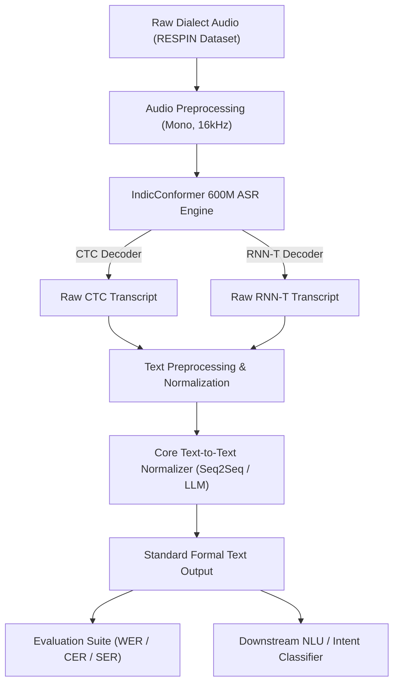

# Academic Project Poster Layout & Content Blueprint

---

## PROBLEM FORMULATION

### Context/Domain Background
* **Linguistic Scale & Complexity:** India is home to 22 officially recognized languages and hundreds of regional sub-dialects. Speech recognition systems deployed for public utility—such as agricultural advisories (farmer query systems) and financial inclusion (rural banking/loans)—must operate across vast acoustic and lexical variations.
* **Dialectal Variation:** Speakers in rural regions use localized vocabulary, colloquial phrasing, and non-standard syntax that differ significantly from standard formal registers taught in digital voice systems.

### Limitations of Existing Methods
* **Baseline ASR Degradation:** State-of-the-art multilingual ASR architectures (e.g., IndicConformer-600M, Whisper) are pre-trained primarily on standard formal speech.
* **Empirical Drop on Sub-Dialects:** When evaluated on regional dialect speech (such as IISc RESPIN sub-dialects D1–D5), baseline Word Error Rate (WER) degrades sharply (e.g., Marathi D1 WER reaching **34.59%**, Telugu D2 WER **31.24%**).
* **Phonetic & Lexical Misalignments:** Standard ASR acoustic models output phonetically literal transcriptions of dialect words that downstream Natural Language Understanding (NLU) units fail to recognize due to Out-Of-Vocabulary (OOV) tokens.

### Proposed Solution Brief
* **Phase 1 (Current Benchmark Evaluation):** An automated evaluation pipeline (`dialect_norm`) measuring baseline ASR performance (CTC & RNN-T decoders) across **9 Indic RESPIN datasets** to empirically quantify dialectal degradation.
* **Core Proposition (Target Model):** A lightweight, post-ASR **Text-to-Text Normalisation Model** (Sequence-to-Sequence / mT5 / IndicBART) that ingests raw dialect transcriptions and translates them into standardized target language text ($\text{Dialect Transcript} \rightarrow \text{Standard Normalized Text}$).

---

## MOTIVATION

### The Gap
* Current ASR pipelines output verbatim phoneme/subword transcriptions of non-standard dialect speech.
* Downstream NLP modules (slot-filling, intent classification, machine translation, LLM agents) fail when encountering non-standard dialectal phrasing and regional vocabulary.

### The Shift
* Re-training massive ASR acoustic models for every sub-dialect requires hundreds of hours of paired audio-text data, which is unavailable for under-resourced dialects.
* **Our Approach:** Decoupling speech-to-text from dialect adaptation by introducing an efficient **Post-ASR Text-to-Text Normalisation Layer**.

### The Impact
* Restores high NLU accuracy for rural speakers without requiring costly acoustic model re-architecting.
* Enables robust, voice-first access to e-governance, agricultural advisories, and financial services for non-standard dialect speakers.

---

## INTRODUCTION

### Domain Definitions
* **Dialect Normalisation:** The task of mapping non-standard, regional dialectal text expressions into standard orthographic and grammatical forms.
* **IISc RESPIN Dataset:** Benchmark dataset for Resilient Speech Recognition in Indic Languages covering 9 languages across Agriculture and Banking domains and 4-5 regional sub-dialects (D1–D5) per language.
* **Hybrid CTC / RNN-T Decoding:** Conformer architecture featuring parallel Connectionist Temporal Classification (CTC) and Recurrent Neural Network Transducer (RNN-T) prediction heads.

### Key Biomarkers / Key Metrics
* **Word Error Rate (WER):** Percentage of word substitutions, deletions, and insertions relative to reference text. Computed for both **Raw** and **Normalized** text.
* **Character Error Rate (CER):** Character-level edit distance ratio.
* **Sentence Error Rate (SER) & Exact Match Accuracy %:** Fraction of utterances transcribed with zero errors.
* **Edit Distance Breakdown:** Substitutions, Deletions, Insertions, and Hits count.

### Application Scope
* Voice-driven agricultural query systems (e.g., Kisaan Call Center voice bots).
* Voice banking interfaces for rural micro-finance and loan applications.
* Multi-dialect speech-to-text-to-translation pipelines.

### Clinical / Technical Impact
* Eliminates the 10–25% WER penalty observed on rural sub-dialects.
* Provides clean, standardized text representations to downstream NLU engines without modifying underlying speech acoustic encoders.

---

## LITERATURE SURVEY

* **Rule-Based & Lexicon Mapping (Traditional Baseline):**
  * *Method:* Hand-crafted G2P rules and phonetic dictionary mapping.
  * *Limitations:* Rigid, unscalable, fails on out-of-vocabulary dialectal phrases and contextual variations.
* **End-to-End Multilingual ASR (IndicConformer-600M / Whisper):**
  * *Method:* Large hybrid CTC/RNN-T model pre-trained on 22 Indic languages using language conditioning tags (`<|hi|>`, `<|mr|>`, `<|bn|>`).
  * *Limitations:* Achieves good accuracy on standard registers (e.g., Hindi D3 WER **9.83%**), but degrades significantly on regional dialects (e.g., Hindi D2 WER **15.40%**, Marathi D1 WER **34.59%**).
* **Acoustic Model Fine-Tuning (Lightweight / Domain Adaptation):**
  * *Method:* Fine-tuning Conformer encoder layers directly on target dialect audio.
  * *Limitations:* Requires paired audio-transcript data which is scarce for under-resourced dialects; prone to catastrophic forgetting across standard languages.
* **Post-ASR Sequence-to-Sequence Text Normalisation (State-of-the-Art / Proposed Direction):**
  * *Method:* Transformer-based Text-to-Text models (mT5, IndicBART, Llama) trained to rewrite non-standard dialect transcripts into standard formal text.
  * *Trade-off:* Highly parameter efficient and modular; requires structured parallel dialect-standard text pairs.

---

## PROPOSED METHODOLOGY

### Step-by-step Technical Pipeline

```
[ Input Audio ]
       │
       ▼
[ IndicConformer-600M ASR Engine ]  ──►  Outputs Raw Dialect Transcript
       │
       ▼
[ Text Preprocessor ]               ──►  Removes Punctuation & Normalizes Whitespace
       │
       ▼
[ Text-to-Text Normalisation Model ]──►  Seq2Seq Model (mT5 / IndicBART) 
       │                                 Rewrites Dialect Text -> Standard Text
       ▼
[ Standard Normalized Text Output ] ──►  Sent to Downstream NLU & Evaluated (WER/CER)
```

1. **Input & ASR Inference:** Audio signals resampled to 16 kHz mono; processed by IndicConformer-600M using CTC and RNN-T decoders to yield raw dialect transcriptions.
2. **Text Preprocessing:** Indic punctuation removal and whitespace normalization via `normalize_text()`.
3. **Core Text-to-Text Normalisation Model (Next Target):** Sequence-to-Sequence model (mT5 / IndicBART) trained on parallel dialect-to-standard text pairs to rewrite localized dialectal phrasing into standard formal orthography.
4. **Output Prediction & Evaluation Unit:** Evaluates raw vs. normalized WER, CER, SER, and Exact Match accuracy; outputs standardized text for NLU integration.

### System Design Diagram (Visual)



---

## TIMELINE

* **Phase 1 (Completed — First Evaluation Benchmark):**
  * Built modular Python evaluation suite `dialect_norm`.
  * Set up datasets across **9 RESPIN languages** (Bhojpuri, Bengali, Chhattisgarhi, Hindi, Kannada, Magahi, Marathi, Maithili, Telugu).
  * Executed baseline benchmarks for IndicConformer-600M across all 9 languages (CTC & RNN-T decoders).
  * Generated structured dual-YAML benchmarks (`*_detailed.yaml` and `*_summary.yaml`) stored in `baseline-indic-conformer/`.
  * Documented empirical sub-dialect degradation baselines (e.g., Marathi WER range: 11.57% to 34.59%).

* **Phase 2 (Upcoming — Text-to-Text Normalisation Model Development):**
  * Curate and generate synthetic parallel dialect-to-standard text dataset pairs from RESPIN transcriptions.
  * Train and fine-tune Sequence-to-Sequence Text-to-Text models (mT5 / IndicBART / LLM).
  * Evaluate end-to-end pipeline ($\text{ASR} + \text{Text-to-Text Normalizer}$) against baseline ASR transcripts.
  * Deploy unified evaluation CLI and interactive demonstration interface.

---

## CONCLUSION

### Summary of Progress
* Developed a fully modular, reproducible evaluation suite (`dialect_norm`) for Indic speech recognition.
* Benchmarked 9 Indic languages on the IISc RESPIN dataset, establishing quantitative WER/CER baselines across dialects D1–D5 and Agriculture/Banking domains.
* Verified that baseline ASR performance experiences severe degradation on regional sub-dialects, confirming the critical need for post-ASR normalisation.

### Future Work / Vision
* Develop a parameter-efficient **Text-to-Text Normalisation Model** to map non-standard dialect transcripts to standard formal text.
* Integrate the text-to-text normalizer into task-oriented NLU dialogue systems for rural voice banking and agricultural advisory platforms.

---

## REFERENCES

1. AI4Bharat, "IndicConformer: Multilingual Speech Recognition for Indian Languages," 2023.
2. IISc RESPIN Consortium, "Resilient Speech Recognition in Indic Languages (RESPIN) Benchmark Dataset," 2023.
3. Xue, M. et al., "mT5: A massively multilingual pre-trained text-to-text transformer," *NAACL*, 2021.
4. Arora, A. et al., "IndicBART: A Pre-trained Sequence-to-Sequence Model for Indic Languages," *ACL*, 2022.
5. JiWER: Python package for calculating Word Error Rate (WER), Character Error Rate (CER), and Match Error Rate (MER).
